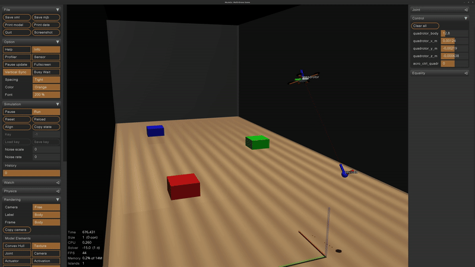

# ACP MuJoCo Payload Transportation Simulator Setup



At this point, you should have successfully installed all required **ACP Lab core packages**.


To use the **ACP MuJoCo Simulator** for payload transportation, we recommend creating a **dedicated ROS 2 workspace**:

```text
payload_transportation_ws
```

---

## 1. Create and Configure the Workspace

Create the workspace directory (the location is up to you) and export it as an environment variable.

### Edit your `~/.bashrc`

```bash
vim ~/.bashrc
```

Add the following line (adjust the path if needed):

```bash
export COLCON_WS_DIR="$HOME/payload_transportation_ws"
```

Reload your environment:

```bash
source ~/.bashrc
```

> **Note**
> `~/payload_transportation_ws` is only an example. Ensure this path matches the actual location of your workspace.

---

## 2. Create the Setup Script

Navigate to your workspace:

```bash
cd $COLCON_WS_DIR
```

Create a setup script:

```bash
vim setup_acp_payload_transportation_simulator.sh
```

Paste the following content:

```bash
#!/bin/bash
set -e

mkdir -p src
cd src

# Start SSH agent and add key
eval "$(ssh-agent -s)"
ssh-add ~/.ssh/id_ed25519

# ACP autonomy stack
if [ ! -d "acp-autonomy-stack" ]; then
  git clone git@github.com:acp-lab/acp-autonomy-stack.git
  pushd acp-autonomy-stack
  git checkout payload_transportation_simulator
  popd
fi

# Quadrotor control
if [ ! -d "acp-quadrotor-control" ]; then
  git clone git@github.com:acp-lab/acp-quadrotor-control.git
  pushd acp-quadrotor-control
  git checkout payload_transportation_simulator
  popd
fi

# DQ-NMPC
if [ ! -d "dq_nmpc" ]; then
  git clone git@github.com:acp-lab/dq_nmpc.git
  pushd dq_nmpc
  git checkout payload_transportation_simulator
  popd
fi

# Raspberry Pi ROS 2 interface
if [ ! -d "pi_ros2_interface" ]; then
  git clone git@github.com:acp-lab/pi_ros2_interface.git
  pushd pi_ros2_interface
  git checkout main
  popd
fi

# ACP MuJoCo simulator
if [ ! -d "acp_mujoco_simulator" ]; then
  git clone git@github.com:acp-lab/acp_mujoco_simulator.git
  pushd acp_mujoco_simulator
  git checkout payload_transportation_simulator
  popd
fi

cd ..

# Build workspace
source /opt/ros/humble/setup.bash
colcon build --symlink-install --cmake-args -DCMAKE_BUILD_TYPE=Release
source install/setup.bash
```

---

## 3. Make the Script Executable

```bash
chmod +x setup_acp_payload_transportation_simulator.sh
```

---

## 4. Run the Setup Script

From inside your workspace:

```bash
cd $COLCON_WS_DIR
source setup_acp_payload_transportation_simulator.sh
```

This will clone all required repositories and build the workspace.

---

## 5. Build DQ-NMPC (Base Controller)

To build and use **DQ-NMPC** as the base controller for payload transportation:

```bash
cd $COLCON_WS_DIR/src

# Clone dual-quaternion C++ library
git clone git@github.com:acp-lab/dq_cpp.git
cd dq_cpp
git checkout payload_transportation_simulator

# Build DQ-NMPC for onboard usage
cd $COLCON_WS_DIR/src/dq_nmpc
chmod +x build_dq_nmpc_onboard.sh
source build_dq_nmpc_onboard.sh
```

When prompted for the platform type, enter:

```text
eagle
```

> **Note**
> Ensure all dependencies are installed and that the `dq_nmpc` repository was cloned in the previous steps.

---

## 6. Install MuJoCo

We use the **latest stable MuJoCo version** available at the time of this project.

From inside your workspace:

```bash
cd $COLCON_WS_DIR
```

Download and extract MuJoCo:

```bash
curl -L -o mujoco-3.4.0-linux-x86_64.tar.gz \
https://github.com/google-deepmind/mujoco/releases/download/3.4.0/mujoco-3.4.0-linux-x86_64.tar.gz

tar -xzf mujoco-3.4.0-linux-x86_64.tar.gz
rm mujoco-3.4.0-linux-x86_64.tar.gz
```

Clone MuJoCo ROS utilities:

```bash
cd $COLCON_WS_DIR/src
git clone git@github.com:acp-lab/MujocoRosUtils.git
cd MujocoRosUtils
git checkout payload_transportation_simulator
```

Build the MuJoCo ROS utilities:

```bash
cd $COLCON_WS_DIR
colcon build \
  --packages-select mujoco_ros_utils \
  --cmake-args \
    -DCMAKE_BUILD_TYPE=RelWithDebInfo \
    -DMUJOCO_ROOT_DIR=$COLCON_WS_DIR/mujoco-3.4.0

source install/setup.bash
```

---

## 7. Run the Simulator

### Start the MuJoCo simulator

```bash
cd $COLCON_WS_DIR
source install/setup.bash
ros2 launch acp_autonomy single_quadrotor_mujoco_sim.launch.py
```

### Start MAV manager

```bash
ros2 run mav_manager mav_manager_service_exec
```

### Run trajectory manager tests

```bash
ros2 run mav_manager_test main_test
```
